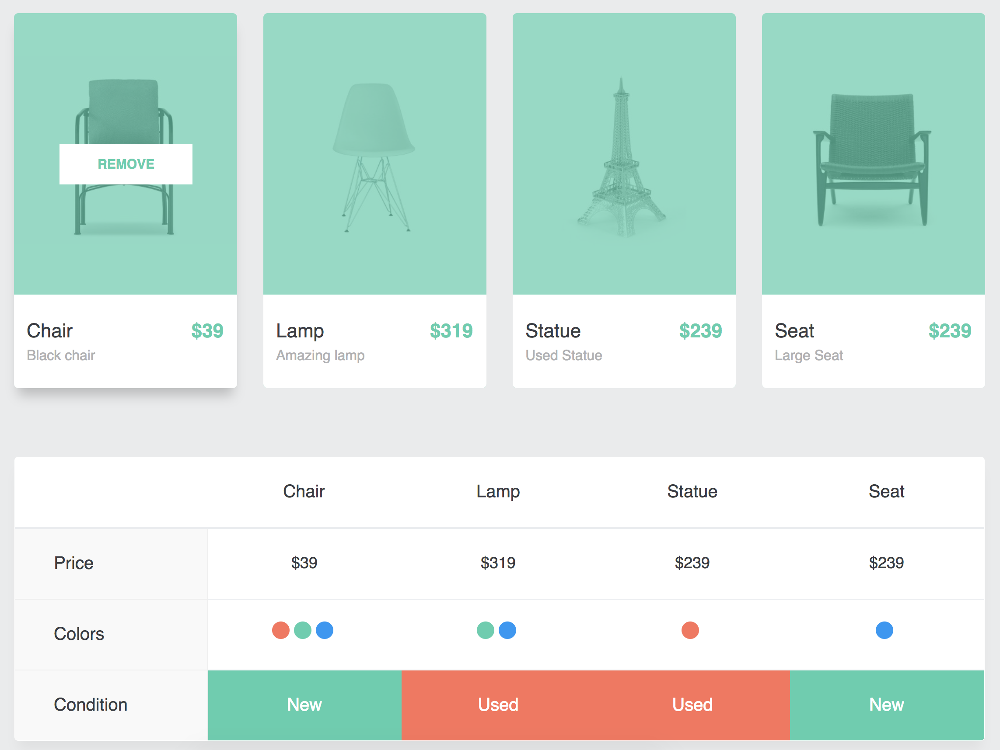

EJERCICIO 2: COMPARAR TARJETAS
---
Se debe desarrollar una aplicación que a partir de una fuente de datos, genere una lista de productos. Siendo cada producto una tarjeta.

Al seleccionar una tarjeta, se debe añadir el detalle del producto a un listado de comparación. Al seleccionar por segunda vez la misma tarjeta, se debe remover el producto del listado de comparación.

El listado de comparación debe mostrar el precio, colores disponibles y condición de cada producto añadido.  

## Fuente de datos

### Productos
- ruta: `./public/products.json`
- url: `/products.json`

```javascript
const products = [
  {
    colors: ['red', 'green', 'blue'],
    condition: 'New',
    excerpt: 'Black chair',
    id: 1,
    image: 'https://c1.staticflickr.com/1/949/41033907875_924ec75fd3.jpg',
    name: 'Chair',
    price: 39,
  }, {
    colors: ['green', 'blue'],
    condition: 'Used',
    excerpt: 'Amazing lamp',
    id: 2,
    image: 'https://c1.staticflickr.com/1/866/40126074680_f986cb8997.jpg',
    name: 'Lamp',
    price: 59,
  }, {
    colors: ['red'],
    condition: 'Used',
    excerpt: 'Used Statue',
    id: 3,
    image: 'https://c1.staticflickr.com/1/946/41933631101_d9c9f28648.jpg',
    name: 'Statue',
    price: 139,
  }, {
    colors: ['blue'],
    condition: 'New',
    excerpt: 'Large Seat',
    id: 4,
    image: 'https://c1.staticflickr.com/1/976/41933630631_a993586e19.jpg',
    name: 'Seat',
    price: 89,
  },
];
```

## Niveles de dificultad
1. Utilizar objeto literal `products` como estado inicial
2. Consumir archivo JSON `products.json` mediante acción
3. Utilizar una acción asíncrona para consumir archivo JSON `products.json`

## Ejemplo de resultado


## Recursos
- [Documentación oficial de React.js](https://reactjs.org/docs)
- [Documentación oficial de Redux.js](https://redux.js.org/)
- [Repositorio oficial de Create React App](https://github.com/facebook/create-react-app)

***
© [DesafioLatam](https://desafiolatam.com) - Todos los derechos reservados
